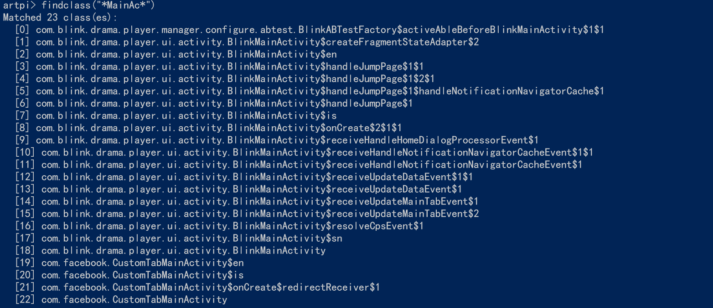
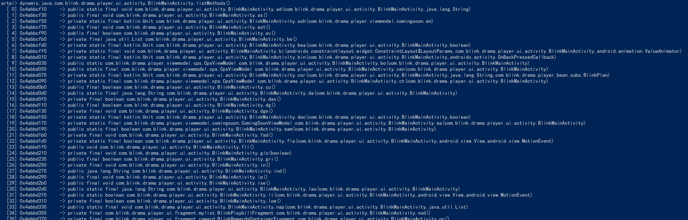
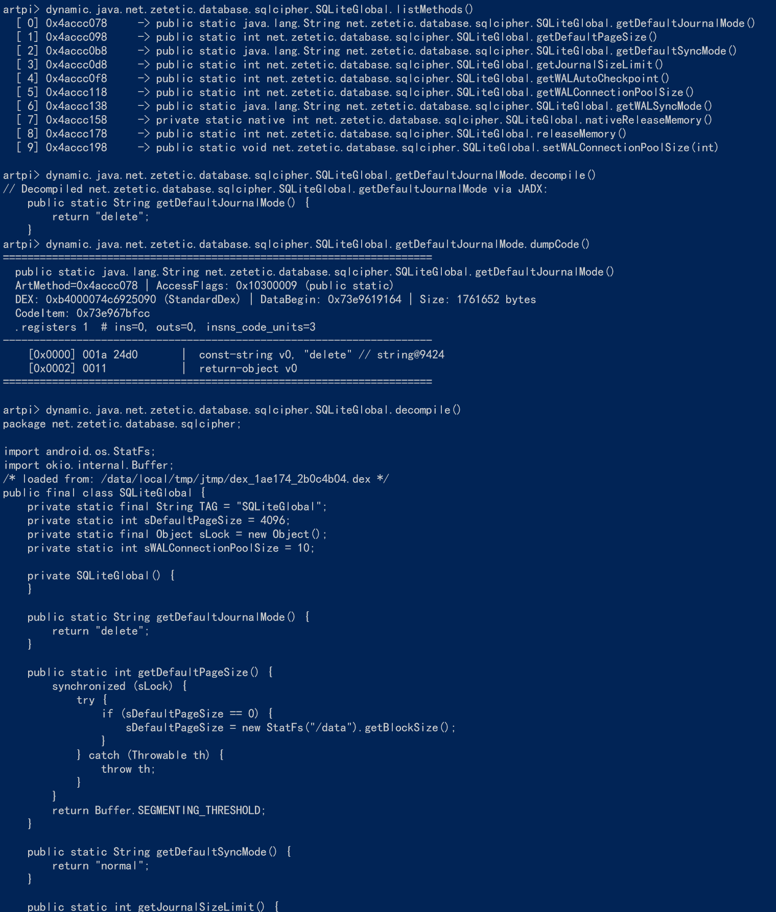
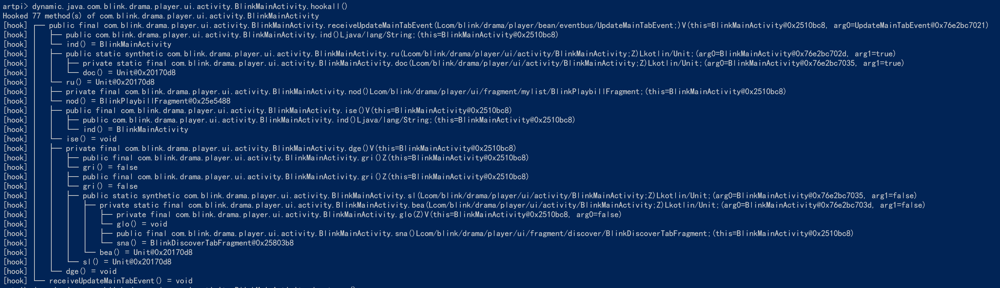
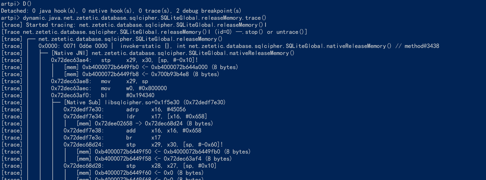
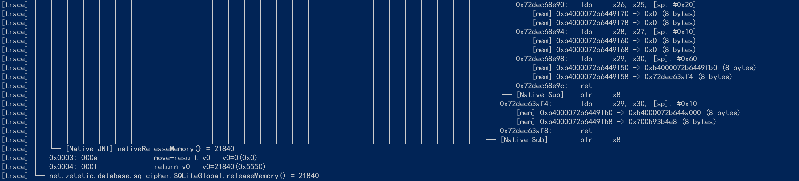
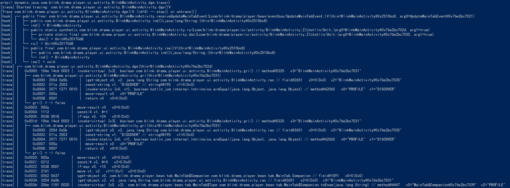
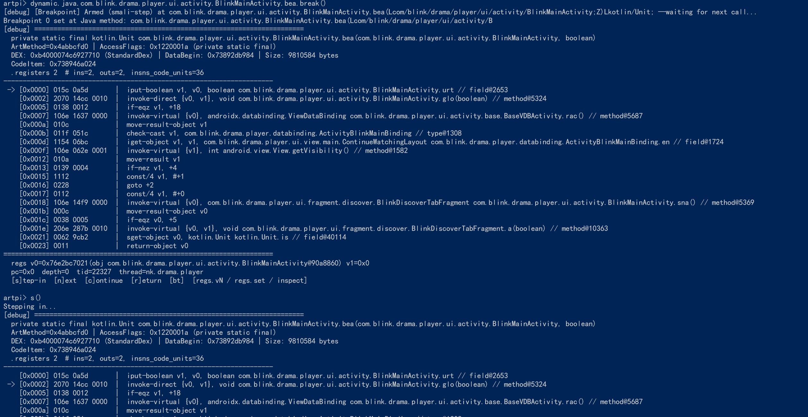
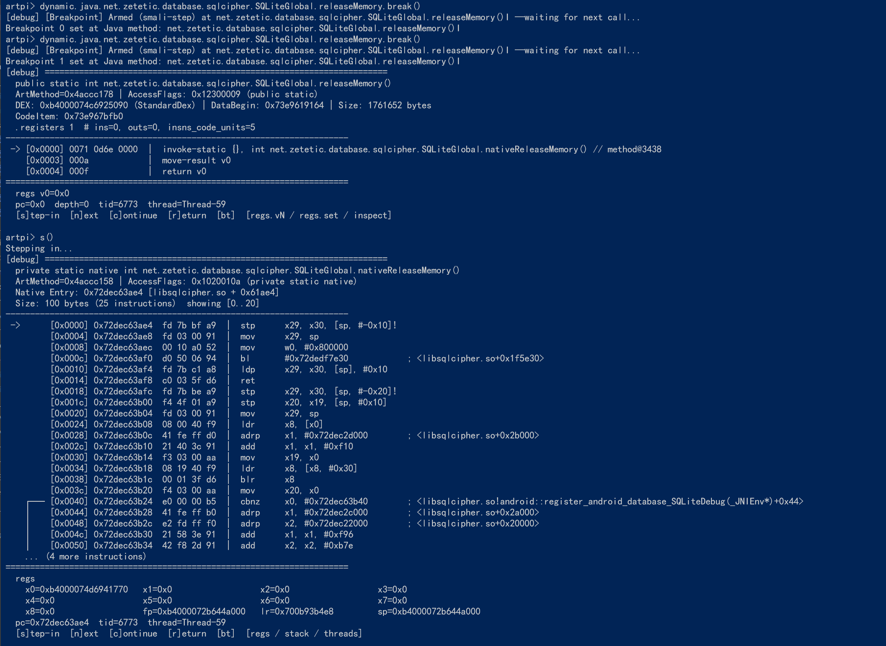
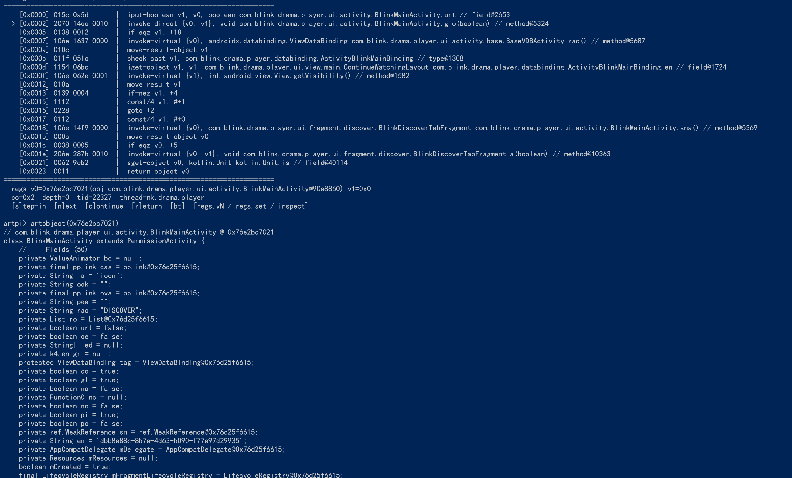

# ArtPI (Art Process Inspector)

> 面向 Android ART 运行时的**高性能原生动态分析与注入工具包**。  
> 支持 Java 方法 Hook、Smali 反汇编与**运行时 JADX 单类/单方法免 OOM Java 反编译**、堆内存实例枚举（`choose`）、Dalvik 字节码解释沙箱（单步 / StepIn / Mock）、Java↔Native 全栈混合追踪，并通过 **ptrace 一键注入 + 多 Payload 链式内嵌 + 内置 QuickJS REPL** 实现终端交互与脚本自动化。

适用平台：**Android 7.0 ~ 15（arm64-v8a）**，进程注入需 root。

### 测试验证基准设备 (Test Platform)

| 属性 | 参数 / 说明 |
|---|---|
| **设备型号 (Model)** | Google Pixel 6 (`oriole`) |
| **处理器 (SoC)** | Google Tensor (GS101, 8 核 64 位 arm64-v8a) |
| **操作系统 (OS)** | Android 13 (Tiramisu, API Level 33) |
| **系统构建号 (Build ID)** | `TP1A.220624.021` |
| **Linux 内核 (Kernel)** | `5.10.107-android13-4-00005-ge05ae1680b1c-ab8715050` |
| **Root 环境** | APatch (Kernel Patch, SuperUser v11039) / Magisk |
| **SELinux 状态** | Permissive / Enforcing（内置安全上下文自动适配） |

---

## 1. 核心能力

| 能力 | 说明 |
|---|---|
| **Java 方法 Hook** | `PI::resolve(...).hook(cb)`，`frame[0]` 读写参数、`setResult` 篡改返回值、`invokeOriginal` 调用原方法；支持类级 `hookall` |
| **高阶 Java 反编译** | 基于单 DEX 内存快速导出与内嵌 JADX CLI，实现秒级**免 OOM 单类与单方法高阶 Java 源码反编译**（`.disassembly()` / `.decompile()`） |
| **Smali 反汇编** | 运行时直接从内存 `CodeItem`（StandardDex / CompactDex）极速 dump 规范 Smali 指令流与寄存器状态 |
| **堆实例扫描 (`choose`)** | 类似 Frida `Java.choose`，支持纯 Native GC 物理扫描与 JVMTI 极速遍历双模式，实时捕获并操作存活对象 |
| **字节码解释沙箱** | 内嵌 nmmvm 解释器重放方法体，支持指令级单步、`StepIn` 递归解释、`Mock` 返回值打桩、异常拦截 |
| **全栈混合追踪** | Java 解释执行遇到 JNI 方法自动交接给 QBDI/Gum，Native 执行完无缝切回，输出连贯的跨层树形调用栈 |
| **动态对象反射链** | `artobject(addr)` 持久化提升全局引用，支持链式属性读写、方法调用与 REPL Tab 实时补全 |
| **ptrace 链式内嵌注入** | 单个 `artpi-cli` 二进制**联合内嵌 Agent SO 与 JADX CLI Jar**，自动解压部署，支持 `-P <pid>` / `-k <pkg>` / `-f <file>` |
| **内置 QuickJS REPL** | 注入后直接进入交互终端，支持动态代理树 `dynamic.java` / `dynamic.native`，免重编动态分析 |

---

## 2. 架构总览

```text
┌────────────────────────────────────────────────────────────────────────┐
│ 宿主交互层 (Host / adb shell 终端)                                      │
│ 支持交互式 REPL、单行 -e 求值、脚本文件执行 -f <script.js>                   │
└───────────────────────────────────┬────────────────────────────────────┘
                                    │ 多 Payload 链式打包 (自包含)
┌───────────────────────────────────▼────────────────────────────────────┐
│ artpi-cli (arm64 root 可执行文件)                                       │
│   [注入器 ELF][libartpi_agent.so][PPAYLOAD][jadxcli.jar][PJADXJAR]     │
│   • 启动时自解压释放 jadxcli.jar 到 /data/local/tmp (0666)             │
│   • 部署 so 到 App lib 目录 → ptrace 远程 __loader_android_dlopen_ext  │
└───────────────────────────────────┬────────────────────────────────────┘
                                    │ 注入到目标 App 进程
┌───────────────────────────────────▼────────────────────────────────────┐
│ libartpi_agent.so  (链接 libartpi_static.a + QuickJS + 通信层)          │
│   PI::init → QuickJS 运行时 → TCP Agent Server (20700..20800)          │
│   • dynamic.java / dynamic.native 动态链式调用代理                      │
│   • 内存 DEX 单文件导出 + dalvikvm 隔离调用 JADX 反编译                 │
└───────────────────────────────────┬────────────────────────────────────┘
                                    │
┌───────────────────────────────────▼────────────────────────────────────┐
│ libartpi_static.a  (底层能力库)                                          │
│  ├─ engine/pine       Pine Hook 底座 (跳板 / ArtMethod 劫持)            │
│  ├─ engine/art        ART 结构体与全版本动态偏移探测                      │
│  ├─ engine/trampoline arm64 / thumb2 / x86 原生汇编跳板                │
│  ├─ engine/nmmvm      内嵌 Dalvik 字节码解释器                          │
│  ├─ engine/native     Frida-Gum Inline Hook + QBDI DBI 执行器         │
│  ├─ engine/tracer     Java↔Native 跨层统一追踪桥                        │
│  ├─ engine/utils      内存保护 / ELF 解析 / WellKnownClasses            │
│  ├─ src/core          PI::init / resolve / Method / HookHandle / Heap  │
│  ├─ src/dex           StandardDex / CompactDex 解析 + Smali 反汇编    │
│  └─ src/sandbox       CodeItem 提取 / 解释执行器 / 沙箱回调层             │
└────────────────────────────────────────────────────────────────────────┘
```

---

## 3. 目录结构

```text
impl_glm/
├── include/ArtPI.h              # 对外统一门面头文件 (PI::resolve / CallFrame / Native)
├── src/
│   ├── core/                    # 框架主入口、Method 包装、HookHandle、Logger、Heap 扫描
│   ├── dex/                     # DEX 解析与运行时 Smali 反汇编
│   ├── sandbox/                 # 解释沙箱：CodeProvider / Executor / Tracer 回调
│   └── agent/                   # 注入后的 Agent：QuickJS 运行时 + TCP/MessagePack Server + dynamic 代理
├── engine/
│   ├── art/ pine/ trampoline/   # ART 模型、Pine Hook 底座、原生跳板
│   ├── nmmvm/                   # 内嵌 Dalvik 字节码解释器
│   ├── native/                  # Frida-Gum Hooker / QBDI DBI 引擎
│   ├── tracer/unified/          # Java↔Native 统一追踪桥
│   ├── qjs/quickjs/             # QuickJS 引擎源码
│   ├── mpack/mpack.h            # 轻量 MessagePack 编解码 (单头文件)
│   └── utils/                   # 内存、ELF、符号工具类
├── cli/
│   ├── injector/                # artpi-cli：ptrace 注入器 + 多 Payload 打包 + REPL 客户端
│   ├── jadxcli.jar              # 反编译引擎（内嵌到 artpi-cli 中，运行时自动释放）
│   └── artpi_repl.py            # Python 宿主端 REPL 客户端
├── external/                    # xdl (linker 绕过) / xz-embedded / frida-gum / qbdi
├── assets/                      # 静态展示资源
│   └── screenshots/             # 实机交互运行效果截图
└── prebuild/                    # 构建产物 (libartpi.so / libartpi_static.a / libartpi_agent.so / artpi-cli)
```

---

## 4. 快速开始

工程自带 Gradle Wrapper，完全跨平台（Windows / Linux / macOS 同一套命令），零外部环境依赖。

### 4.1 构建命令

```bash
# 产品（核心库 + Agent + 联合内嵌注入器）
./gradlew build                  # = buildNative（构建完整产品线）
./gradlew buildNative            # 三库一端：core / agent / cli
./gradlew libartpi               # 仅核心库
./gradlew :agent:build           # 仅 Agent SO
./gradlew :cli:build             # 仅 CLI（编译注入器并自动联合打包 agent.so + jadxcli.jar）

# 测试套件（按需独立运行）
./gradlew :test:buildTest         # Suite 1 (ArtPI.h 原生 API 测试)
./gradlew :test-js:buildTest      # Suite 2 (QuickJS 绑定测试)
./gradlew :test-harness:buildTest # Playground 演练场

./gradlew cleanNative            # 清理 build/ 与 prebuild/
```

> **环境要求**：已配置 `ANDROID_HOME` / `ANDROID_SDK_ROOT` 或 `NDK_HOME`，也可在同级 `local.properties` 中指定 `sdk.dir=` 与 `ndk.dir=`。构建工具链（`cmake`/`ninja`/`javac`/`d8`/`adb`）由 Gradle 自动索引。

产物分布（均在 `prebuild/`）：

| 产物 | 路径 | 包含内容 |
|---|---|---|
| 单文件 CLI | `prebuild/bin/arm64-v8a/artpi-cli` | 注入器本体 + 内嵌 `libartpi_agent.so` + 内嵌 `jadxcli.jar` |
| Agent 动态库 | `prebuild/lib/arm64-v8a/libartpi_agent.so` | 运行时交互引擎，由 CLI 注入到目标进程 |
| 基础静态库 | `prebuild/lib/arm64-v8a/libartpi_static.a` | 独立嵌入开发用的基础底层静态库 |
| 底层动态库 | `prebuild/lib/arm64-v8a/libartpi.so` | C++ 对外动态库 |
| 头文件 | `prebuild/include/ArtPI.h` | 统一门面 API |

---

### 4.2 部署与运行

```bash
# 1. 部署：仅需推送单个 artpi-cli 到设备 /data/local/tmp（自动授予 755）
./gradlew deploy

# 2. 注入目标应用并进入交互式 REPL
adb shell su -c "/data/local/tmp/artpi-cli -k com.example.app"

# 3. 或者以脚本模式执行单个 JS 脚本文件并退出
adb push my_script.js /data/local/tmp/my_script.js
adb shell su -c "/data/local/tmp/artpi-cli -k com.example.app -f /data/local/tmp/my_script.js"

# 4. 或者在命令行直接对表达式求值
adb shell su -c "/data/local/tmp/artpi-cli -k com.example.app -e 'findclass(\"*Activity\");'"
```

> **连接复用**：`artpi-cli` 自动扫描 `20700..20800` 端口并对已注入 Agent 探活复用；若应用未被注入，会自动提取 payload 完成远程 ptrace 注入。若应用未声明 `INTERNET` 权限，自动降级为抽象 UNIX Domain Socket（`@artpi_agent_<pid>`）。

---

## 5. 实机交互演示 (Showcase)

ArtPI 注入目标进程后，通过终端进入内置 QuickJS REPL 即可获得交互式动态逆向体验：

### 5.1 类检索与模糊匹配 (`findclass`)
支持通配符与正则模式，秒级枚举当前运行时中所有已加载的类并输出唯一句柄：


### 5.2 类声明方法与签名列举 (`listMethods`)
快速列出目标类的所有声明方法、访问标志位（`public/private/static/final` 等）及底层 `ArtMethod*` 指针：



### 5.3 一键批量 Hook 拦截 (`hookall`)
无需繁琐编写单个钩子，一键完成整类非抽象/原生方法批量插桩，自动格式化打印被调对象、参数实参及返回结果：


### 5.4 跨层树形调用链路追踪 (`Trace.unified` / `trace`)
全栈贯通 Java 解释执行与 Native C/C++ 机器码，遇到 JNI 边界自动交接，输出连贯的跨层调用链路树：
- **跨层追踪启动与跨边界交接**：

- **跨层完整链路执行树**：

- **单方法细粒度追踪**：


### 5.5 断点拦截与单步调试 (`break`)
在关键方法处下断点拦截执行，支持单步步入/步过（`s`/`n`/`c`）与实时寄存器状态打印（`regs`）：


### 5.6 Java $\to$ Native 跨层单步穿透
单步调试支持无缝穿透 JNI 边界深入底层 Native 机器码，同步观察 ARM64 寄存器状态与反汇编指令：


### 5.7 活体对象反射持久化 (`artobject`)
获取堆内实例后直接提升为持久化全局引用，支持交互式反射调用成员方法与属性读写：


---

## 6. JavaScript 运行时 API 手册

### 6.1 动态代理链 (`dynamic.*`) — 首选交互方式

`dynamic` 提供类似属性树的直观链式调用，支持点号智能路由（包名、类名、内部类、方法名全自动解析）。

#### 1. Java 类与方法代理 (`dynamic.java.*`)

```javascript
// 1. 获取类包装对象 (ClassBox)
let Act = dynamic.java.com.blink.drama.player.ui.activity.download.BlinkDownloadManageActivity;

// 类级操作
Act.dumpCode();           // 遍历 dump 该类所有声明方法的汇编代码
Act.dumpSmali();          // 遍历 dump 该类所有声明方法的 Smali 助记符
Act.listMethods();        // 列出所有声明方法信息及 ArtMethod* 指针
Act.findMethods("on*");   // 模糊查找类内方法
Act.hookall(cb?);         // 一键 Hook 该类全部非 abstract/native 方法

// 类级反编译：输出整类的完整 Java 源码（免 OOM 极速反编译）
console.log(Act.disassembly());  // 或 Act.decompile()

// 堆实例扫描：搜索当前进程堆中所有该类的活体对象
Act.choose({
    onMatch: function(instance) {
        console.log("Found instance: " + instance);
    },
    onComplete: function(total) {
        console.log("Total found: " + total);
    }
});

// 2. 访问类成员方法 (MethodBox)
let oc = Act.onCreate;

// 方法级反编译：精准抽取该方法的 Java 源码块（包含注解与实现体）
console.log(oc.disassembly());    // 或 oc.decompile()

// 方法级 Smali / 原生反汇编
console.log(oc.dumpSmali());      // dump 该方法的 Smali 字节码
console.log(oc.dumpCode());       // 自动识别 Java/Native 并 dump 代码

// 安装 Hook
oc.hook(function(ctx) {
    console.log("onCreate called! this=" + ctx.thiz);
    // 可选篡改返回值：ctx.setResult(...);
});

// 单步调试与断点
oc.break();                       // 在该方法入口下断点，进入单步调试模式
oc.trace({ mode: "CALL_TREE" });  // 树形追踪执行链路
```

#### 2. Native 动态库与符号代理 (`dynamic.native.*`)

```javascript
// 获取 Native 模块（自动补齐 .so）
let lib = dynamic.native.libart;

// 访问函数符号并操作
let fn = lib.art_quick_to_interpreter_bridge;
fn.dumpNative(30);                // 反汇编前 30 条 ARM64 汇编指令
fn.hexdump(64);                   // 打印 64 字节十六进制内存 Dump
fn.hook(function(ctx) {           // Frida-Gum Inline Hook
    console.log("x0 =", ctx.args[0]);
});
```

---

### 6.2 `Java.*` — 核心 Java 与 ART 域

| API | 签名 | 返回值 | 说明 |
|---|---|---|---|
| `Java.findClass` | `(pattern[, limit])` | `BigInt` / `string` / `null` | 精确类名返回 `jclass` 指针；含 `* ?` 通配符时返回匹配列表（统一 `0xxxx -> name` 格式） |
| `Java.findMethod` | `(clsOrName, name[, sig])` | `BigInt` / `null` | 查找 `ArtMethod*` 指针；自动沿着类继承链向上遍历父类 |
| `Java.listMethods` | `(clsOrName)` | `string` | 格式化列出当前类声明的所有方法及指针 |
| `Java.findMethods` | `(classOrPattern[, mPattern])`| `string` | 单类或跨类通配符查找方法 |
| `Java.decompile` | `(clsOrMethod[, mName])` | `string` | **JADX 单类/单方法 Java 反编译**；自动 Fallback Smali。别名 `Java.disassembly` |
| `Java.dumpSmali` | `(artMethod[, maxInsn])` | `string` | 纯 Native 内存直接解析输出规范 Smali 指令流 |
| `Java.dumpCode` | `(artOrAddr[, maxInsn])` | `string` | 统一反汇编（自动分发 Smali 或 ARM64 汇编） |
| `Java.choose` | `(className[, callbacks])` | `array` / `number` | **堆实例枚举**；传回调为异步消费模式，省略回调同步返回实例数组 |
| `Java.hook` | `(artMethod[, callback])` | `string` | 安装 Hook；不传回调为默认入参/出参格式化打印模式 |
| `Java.unhook` | `(id)` | `string` | 按 ID 卸载指定的 Hook |
| `Java.unhookAll` | `()` | `string` | 卸载全部 Java Hook |
| `Java.methodInfo` | `(artMethod)` | `object` | 提取方法的修饰符、类名、签名、编译状态及 nativeEntry |

> **全局别名**：`findclass`、`findmethod`、`listmethods`、`dumpsmali`、`dumpcode`、`decompile`、`disassembly`、`choose`、`jhook`、`unhook`、`unhookall` 均可直接在全局作用域调用。

---

### 6.3 `Native.*` 与 `DebugSymbol.*` — 原生二进制与符号域

| API | 签名 | 说明 |
|---|---|---|
| `Native.findModule` | `(nameOrPattern)` | 枚举内存模块，返回 `{name, path, base, size}` |
| `Native.findSymbol` | `(module, symbol)` | 通过 xDL 解析模块符号绝对地址 |
| `Native.findSymbolsMatching` | `(module, pattern)` | 读取模块 ELF `.dynsym` 极速通配符过滤符号 |
| `Native.dumpNative` | `(addr[, maxInsn])` | ARM64 原生反汇编（集成符号解析与行内注解） |
| `Native.hook` | `(addrOrSym, cb)` | Frida-Gum Inline Hook（别名 `nhook`） |
| `DebugSymbol.findSymbolByName` | `(pattern[, lib])` | 通配符跨模块搜索符号，支持 C++ Name Demangle 双向匹配 |
| `DebugSymbol.fromAddress` | `(address)` | 内存地址逆向解析为模块名与符号名 |

---

### 6.4 `Memory.*` — 内存安全读写

| API | 签名 | 说明 |
|---|---|---|
| `Memory.hexdump` | `(addr[, len])` | 16 字节十六进制 + ASCII 内存 dump（内置 `process_vm_readv` 保护） |
| `Memory.readByteArray` | `(addr, len)` | 读取原始内存为 `ArrayBuffer` |
| `Memory.writeByteArray` | `(addr, data)` | 写入数据到内存（自动 `mprotect` RWX 绕过段只读） |
| `Memory.readCString` | `(addr)` | 读取以 `\0` 结尾的 C 字符串 |
| `Memory.readU32` / `writeU32` | `(addr[, val])` | 读写 32 位无符号整数 |

---

### 6.5 `Trace.*` 与 `Debug.*` — 协作式单步与追踪

| API | 说明 |
|---|---|
| `Trace.unified(target, opt)` | **真·Java↔Native 全栈贯通追踪**；自动处理跨层调用树 |
| `Trace.java(artMethod, opt)` | Java 方法执行追踪（支持 `CALL_TREE` 树形模式与 `INSN_STEP` 逐指令快照） |
| `brkj(method[, cond])` | 在指定 Java 方法处下断点，命中时暂停线程并启动单步调试 |
| `brkn(addr[, cond])` | 在指定 Native 内存地址下断点 |
| `s` / `n` / `r` / `c` | 单步步入 (Step-In) / 单步步过 (Step-Over) / 步出当前方法 (Step-Return) / 继续运行 (Continue) |
| `bt` | 打印当前断点处真实的 Java 调用栈（包含完整类名、方法名、DEX PC 与**源码行号**） |
| `regs` / `dumpRegs()` | 打印当前断点处的全部寄存器（Java 模式显示 `v0..vN`，Native 模式显示 `x0..x30, fp, lr, sp`） |
| `getreg(n)` / `setreg(n, val)` | 读取或篡改寄存器值（支持整型、浮点、字符串及 Java 对象包装） |
| `D()` / `detach()` | **一键解挂**：撤销全部 Java/Native Hook、Trace，唤醒所有挂起线程并清除断点 |

---

## 7. 反编译架构与原理亮点

为什么 ArtPI 能在 Android 移动端实现**秒级、免 OOM 的 Java 源码反编译**？

1. **精准单 DEX 内存捕获**：
   传统方式是将 App 的整包 `base.apk` 喂给 JADX，导致 JADX 构建数十万个类的全局交叉索引树，内存消耗高达 1GB~2GB，在移动端频繁遭遇 OOM 崩溃。  
   ArtPI 凭借底层直接持有 `ArtMethod*` 与 `DexCache` 的优势，**直接从内存切片提取目标类所在的单 DEX 文件**（通常仅几 MB），耗时只需约 5ms，并附带 checksum 缓存校验。
2. **轻量沙盒执行**：
   通过调用独立进程的 `dalvikvm` 执行内嵌的 `jadxcli.jar`，参数限定为 `--no-res --single-class <className>`，整体反编译在独立的 128~256MB 堆内存沙箱中 2 秒内极速完成，既不干扰 App 自身运行时，也保证了绝对的稳定性。
3. **方法级语法抽取**：
   反编译引擎不仅支持整类查看，在针对单方法调用 `.disassembly()` 时，内部算法自动识别声明签名、注解（`@Override` / `JADX INFO` 等）并匹配大括号作用域，精确提取出整洁易读的 Java 方法实现体。
4. **自包含分发**：
   `jadxcli.jar` 随 `artpi-cli` 打包嵌入在二进制末尾，目标设备首次使用时自动透明释放，无需手动配置外部工具链。

---

## 8. 依赖与致谢

- [Pine](https://github.com/canyie/pine) —— Java 方法 Hook 底座（ART 跳板 / ArtMethod 劫持）
- [JADX](https://github.com/skylot/jadx) —— Dex 转 Java 高性能反编译引擎
- [nmmvm](https://github.com/zb0933/nmmvm) —— 内嵌 Dalvik 字节码解释器
- [Frida-Gum](https://github.com/frida/frida-gum) —— Native Inline Hook 引擎
- [QBDI](https://github.com/quarkslab/QBDI) —— Native 动态二进制插桩（DBI）执行器
- [QuickJS](https://bellard.org/quickjs/) —— 嵌入式轻量 JavaScript 引擎
- [xDL](https://github.com/hexhacking/xDL) —— Android 7.0+ linker namespace 绕过
- [xz-embedded](https://github.com/torvalds/linux/tree/master/lib/xz) —— LZMA 解压缩
